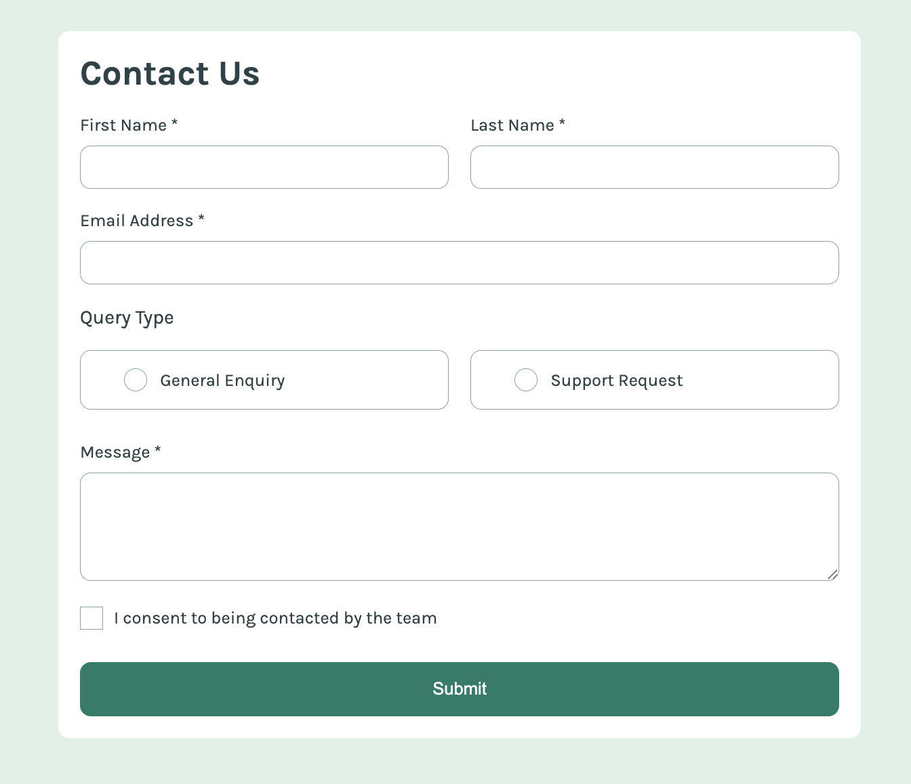
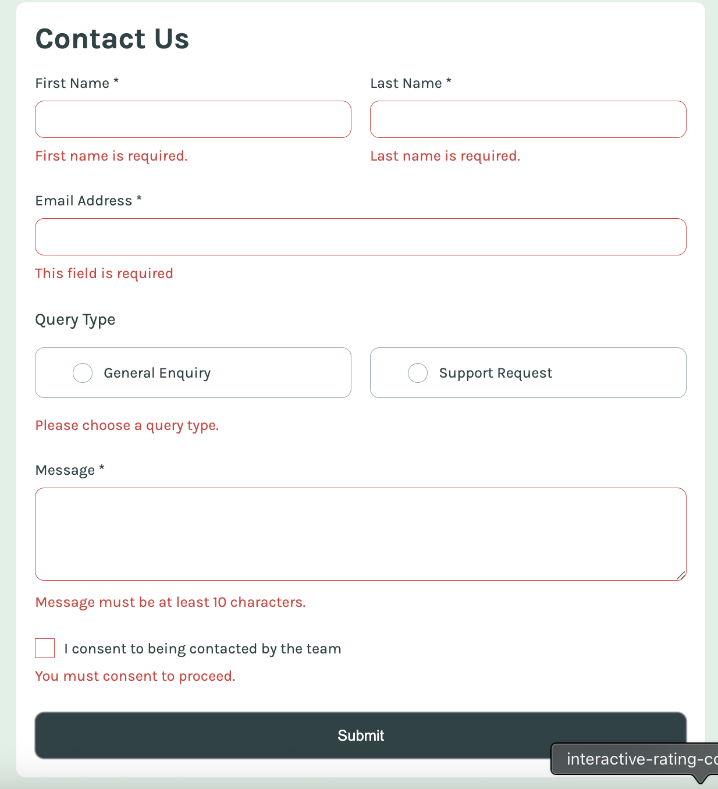
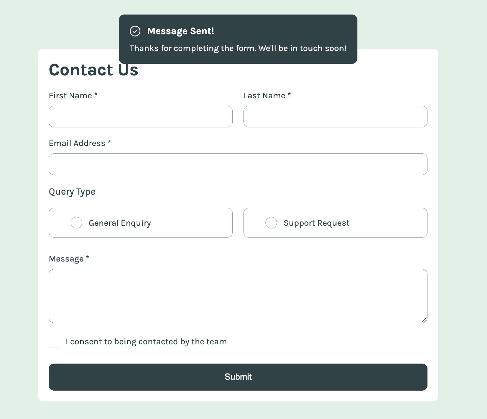

# Frontend Mentor - Contact form solution

This is a solution to the [Contact form challenge on Frontend Mentor](https://www.frontendmentor.io/challenges/contact-form--G-hYlqKJj). Frontend Mentor challenges help you improve your coding skills by building realistic projects.

## Table of contents

- [Overview](#overview)
  - [The challenge](#the-challenge)
  - [Screenshot](#screenshot)
  - [Links](#links)
- [My process](#my-process)
  - [Built with](#built-with)

## Overview

challenge is to build out this contact form and get it looking as close to the design as possible. Pay particular attention to making this form accessible. Building accessible forms is a key skill for front-end developers

### The challenge

Users should be able to:

- Complete the form and see a success toast message upon successful submission
- Receive form validation messages if:
  - A required field has been missed
  - The email address is not formatted correctly
- Complete the form only using their keyboard
- Have inputs, error messages, and the success message announced on their screen reader
- View the optimal layout for the interface depending on their device's screen size
- See hover and focus states for all interactive elements on the page

### Screenshot

#### home page



#### Errors



#### success page



### Links

- Solution URL: https://github.com/SurajChaunal/frontend-mentor-accessible-form.git
- Live Site URL: https://surajchaunal.github.io/frontend-mentor-accessible-form/

## My process

### Built with

- Semantic HTML5 markup
- CSS custom properties
- Flexbox
- CSS Grid
- Mobile-first workflow

### What I learned

Use this section to recap over some of your major learnings while working through this project. Writing these out and providing code samples of areas you want to highlight is a great way to reinforce your own knowledge.

To see how you can add code snippets, see below:

```css
.input:not(input[type="radio"]):not(input[type="checkbox"]):focus-visible {
  outline: 1px solid var(--color-Green-600);
  box-shadow: 0 1px 2px 0px var(--color-Green-600);
}
.input:focus:not(:focus-visible) {
  outline: none; /* remo    ves the default for mouse users */
}

.input--radio:focus-visible + .label--radio {
  box-shadow: 0 1px 2px 0px var(--color-Green-600);
}
.input--checkbox:focus-visible + .label--consent::before {
  box-shadow: 0 0 0 2px var(--color-Green-600);
}
.input.input--error:not(:focus) {
  border: 1px solid var(--color-Red);
}
/* .label--radio.input--error {
  border: 2px solid var(--color-Red);
} */
.input.input--error + .label--consent::before {
  border: 1px solid var(--color-Red);
}
```

```js
const validators = {
  fname: (ctx) => {
    const v = ctx.fname?.value?.trim() || "";
    return { ok: v.length > 0, message: "First name is required." };
  },
  lname: (ctx) => {
    const v = ctx.lname?.value?.trim() || "";
    return { ok: v.length > 0, message: "Last name is required." };
  },
  email: (ctx) => {
    const v = ctx.email?.value?.trim() || "";
    if (!v.length) return { ok: false, message: "This field is required" };
    const ok = /^[^\s@]+@[^\s@]+\.[^\s@]+$/.test(v);
    return { ok, message: "Please enter a valid email address." };
  },
  query: (ctx) => {
    const ok = !!ctx.querySelector('input[name="query"]:checked');
    return { ok, message: "Please choose a query type." };
  },
  message: (ctx) => {
    const v = ctx.message?.value?.trim() || "";
    console.log(v);
    return {
      ok: v.length >= 10,
      message: "Message must be at least 10 characters.",
    };
  },
  consent: (ctx) => {
    const el = ctx.consent;
    console.log(el);
    const ok = el && el.checked;
    return { ok, message: "You must consent to proceed." };
  },
};
```
